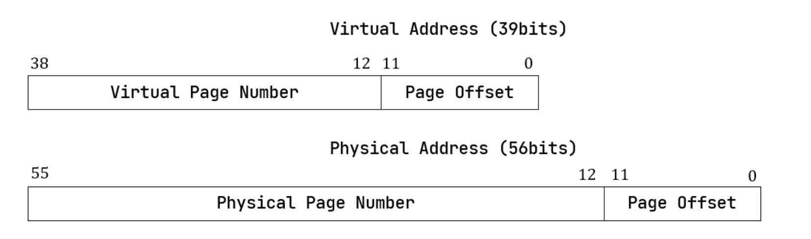
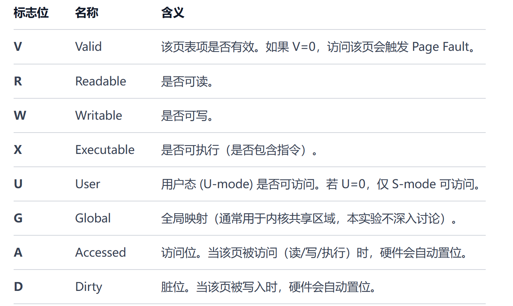

> git checkout master 

解释一下lab4的代码原理

lab4的编写代码是kernel/src/mm/page_table.rs

首先看文档的SV39虚拟地址的划分



虚拟地址映射到物理地址，用一句话说就是查表。先找到物理块号然后偏移.由于sv39是三级页表，所以虚拟地址被划分成三个页表索引。

```text
63          39 38    30 29    21 20    12 11                           0
┌─────────────┬────────┬────────┬────────┬─────────────────────────────┐
│   Reserved  │ VPN[2] │ VPN[1] │ VPN[0] │      Page Offset (12)       │
│    (25)     │  (9)   │  (9)   │  (9)   │                             │
└─────────────┴────────┴────────┴────────┴─────────────────────────────┘
      ▲           ▲        ▲        ▲                   ▲
      │           │        │        │                   │
  符号扩展位    一级索引  二级索引  三级索引            页内偏移
```
文档里这一集的内容是最有效的，给了不少介绍,其他两个会跟着题来进行细讲，如果你没看懂以上的内容，记住一句话就可以虚拟地址通过一个表映射到了物理地址。


## find_pte_create()

这个需要构建一个从虚拟地址到物理地址的映射,并且冲突不创建页表，查询第三个文档内容会发现这样的一个流程
```text
vpn.indexes() = [i0, i1, i2]   // [VPN[2], VPN[1], VPN[0]]

1. 查找 i0
  若 pte.is_valid() == false：
    分配新帧 frame，令 pte = PageTableEntry::new(frame.ppn, V)
    将 frame 存入 self.frames（转移所有权）
    进入二级页表

2. 查找 i1
    同上，若不存在则分配新帧
    进入三级页表

3. 查找 i2
  直接返回该 PTE 的可变引用
```

首先需要得到根页表的物理页号,这个东西存在于页表下
```rust
pub struct PageTable {
    root_ppn: PhysPageNum,
    frames: Vec<FrameTracker>,
}
```
```rust
let mut ppn= self.root_ppn ;
```

然后将索引虚拟地址的页表号进行拆分,得到[i0,i1,i2];

```rust
let index = vpn.indexes() ; 
```
然后就是一个经典的迭代了，一次一次深入的找,对于每个ppn的实现,里面有三个函数，其中第一个可以得到所有的页表
```rust
impl PhysPageNum {
    /// Get the reference of page table(array of ptes)
    pub fn get_pte_array(&self) -> &'static mut [PageTableEntry] {
        let pa: PhysAddr = (*self).into();
        unsafe { core::slice::from_raw_parts_mut(pa.0 as *mut PageTableEntry, 512) }
    }
    /// Get the reference of page(array of bytes)
    pub fn get_bytes_array(&self) -> &'static mut [u8] {
        let pa: PhysAddr = (*self).into();
        unsafe { core::slice::from_raw_parts_mut(pa.0 as *mut u8, 4096) }
    }
    /// Get the mutable reference of physical address
    pub fn get_mut<T>(&self) -> &'static mut T {
        let pa: PhysAddr = (*self).into();
        pa.get_mut()
    }
}
```
然后每次先找到当前页表项的位置
```rust
let pte = &mut ppn.get_pte_array()[*idx] ;
```
判断这个页表存不存在,不在的话就创建,判断的话得下看下图


valid你可以理解成就是还能不能往下找了，合不合法，不能的话得新建。
```rust
if !pte.is_valid() {
    let page = frame_alloc()? ; 
    *pte = PageTableEntry::new(page.ppn , PTEFlags::V) ; 
    self.frames.push(page); 
}
```
* 用到了frame_alloc()能新开一个页表页。(近似理解)
```rust
pub fn frame_alloc() -> Option<FrameTracker> {
    FRAME_ALLOCATOR
        .exclusive_access()
        .alloc()
        .map(FrameTracker::new)
}
```
* 用到了PageTableEntry的new函数，需要传入物理号和标志位为True的位置。
* 同时还用到了frames，里面push一下新页表
  
更新ppn
```rust
ppn = pte.ppn(); 
```

完整代码为
```rust
fn find_pte_create(&mut self, vpn: VirtPageNum) -> Option<&mut PageTableEntry> {
    let index = vpn.indexes() ; // 切分三级页表索引
    let mut ppn= self.root_ppn ; // 根物理页表号
    for (i , idx )in index.iter().enumerate() {
        let pte = &mut ppn.get_pte_array()[*idx] ; //在页表中找到对应的页表项

        if !pte.is_valid() { // 不合法就新开一个
            let page = frame_alloc()? ; 
            *pte = PageTableEntry::new(page.ppn , PTEFlags::V) ; 
            self.frames.push(page); 
        }
        if i == 2  {return Some(pte) ; } 

        ppn = pte.ppn() ; // 更新到新的物理块号
    }
    None 
}
```


听一大堆理论说实话不如来个具体实例:

1. 比如虚拟页号拆分成index后变成[3, 5, 7] 

2. 一开始根物理页号为100,root_ppn = 100

3. pte = root_table[3] , 啥也没有,is_valid == false,所以会新开一个页.
4. 开了一个页后，比如分配给page.ppn为200，则root_table[3]={ppn =200 , V=1},
```text
根页表(100) --[3]--> 二级页表(200)
```
4. ppn =200 ,然后重复上面操作,发现pte = 200_table[5],啥也没有就又新开
```text
根页表(100) --[3]--> 二级页表(200) --[5]--> 三级页表(300)
```

这时候你会发现i== 2直接返回了300_table[7],也就是300地址的页表的第七项

但是啊这还是空的啊，有用吗这样，接下来就是map登场了。

## map() 

在页表中建立一个虚拟页到物理页的映射。首先map得到这个物理页。

```rust
let pte = self.find_pte_create(vpn).unwrap() ;
```
但是，please记住，刚才i == 2 直接返回了，你会发现他的V首先必须是0,也就是没映射过，要是已经映射了还建立什么，是吧,这里用assert来阻断一下，然后对这第七页表项（接着刚才那个）new一下，其中他的物理地址就是这个函数传进来的ppn，他的标志位有flags和V，所以这里V的作用就明显起来了，就是记录是否参与过映射，页表和页表之间也算映射。

```rust
assert!(!pte.is_valid(), "vpn {:?} is mapped before mapping", vpn) ;
*pte = PageTableEntry::new(ppn, flags | PTEFlags::V);
```
接下来就变成了
```text
根页表(ppn=100)
  [3] -> 二级页表(ppn=200)

二级页表(ppn=200)
  [5] -> 三级页表(ppn=300)

三级页表(ppn=300)
  [7] -> 数据页(ppn=400, flags=V|flags)
```

完整代码如下
```rust
pub fn map(&mut self, vpn: VirtPageNum, ppn: PhysPageNum, flags: PTEFlags) {
    let pte = self.find_pte_create(vpn).unwrap() ;
    assert!(!pte.is_valid(), "vpn {:?} is mapped before mapping", vpn) ;
    *pte = PageTableEntry::new(ppn, flags | PTEFlags::V);
}
```
如果理解了上面的过程，那么剩下的编写就不是问题了。
## find_pte()

只读的话把创建过程去掉就对了

```rust
fn find_pte(&self, vpn: VirtPageNum) -> Option<&mut PageTableEntry> {
        let indexs = vpn.indexes() ; 
        let mut ppn = self.root_ppn ; 
        for (i , idx ) in indexs.iter().enumerate() {
            let pte = &mut ppn.get_pte_array()[*idx] ;
            if !pte.is_valid()  {
                return None ; 
            }
            if i == 2  {
                return Some(pte) ;
            }
            ppn = pte.ppn() ;
        }
        return None ;
    }
```

## unmap()

取消页表项的映射的话直接用里面的empty()就好了,文档里面写了:

> unmap 只清零页表项，并不释放被映射的数据物理帧。数据帧的释放由 MapArea.data_frames 中的 FrameTracker 负责（从 BTreeMap 中移除时自动析构）。 中间节点的帧由 PageTable.frames 持有，直到整个 PageTable 销毁时释放。

```rust
pub fn map(&mut self, vpn: VirtPageNum, ppn: PhysPageNum, flags: PTEFlags) {
    let pte = self.find_pte_create(vpn).unwrap() ;
    assert!(!pte.is_valid(), "vpn {:?} is mapped before mapping", vpn) ;
    *pte = PageTableEntry::empty() ;
}
```